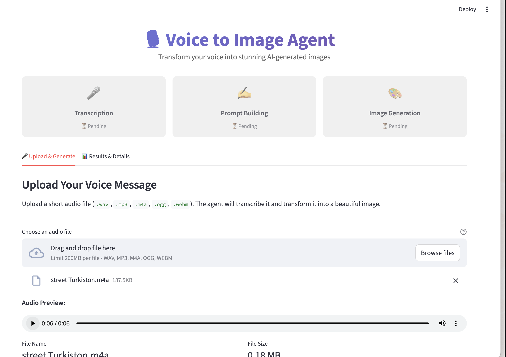
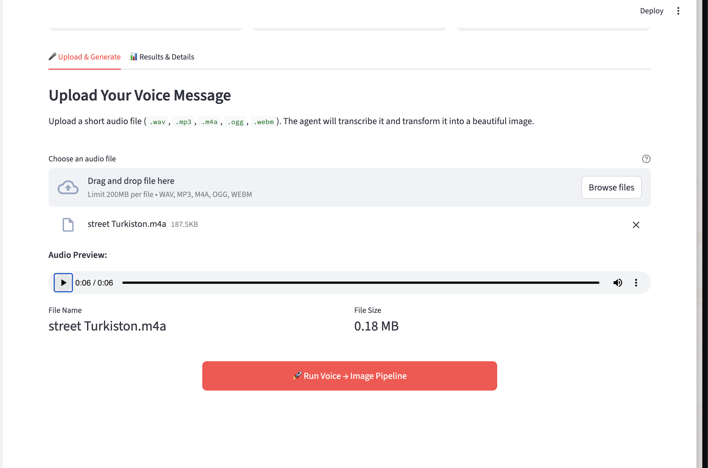
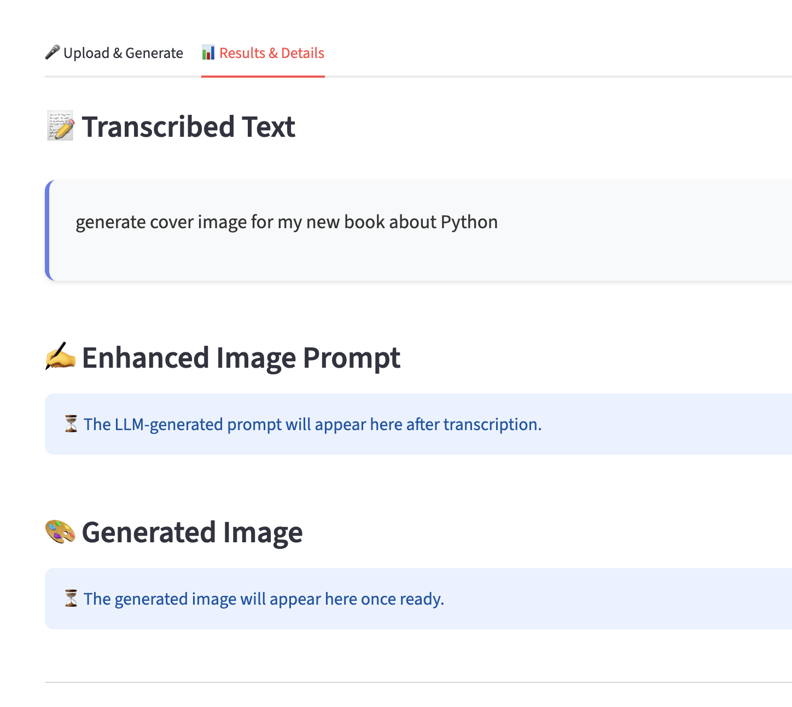
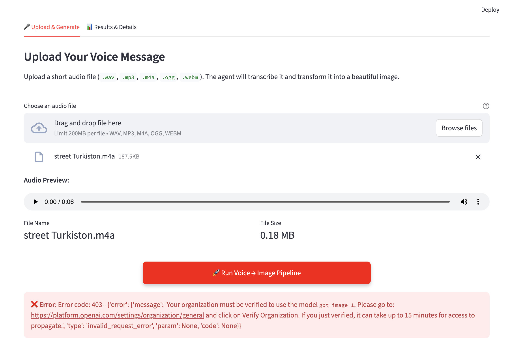

# Voice to Image Agent

A Streamlit-based application that transforms voice messages into AI-generated images through a multi-step pipeline combining speech-to-text, natural language processing, and image generation.

## Overview

This application takes a voice recording and converts it into a visual representation by:

1. **Transcribing** audio to text using OpenAI Whisper
2. **Enhancing** the transcript into a detailed image prompt using GPT-4
3. **Generating** an image from the prompt using DALL-E

The entire pipeline is transparent, showing intermediate results at each step.

## Features

- 🎙️ **Audio Upload**: Support for multiple formats (WAV, MP3, M4A, OGG, WebM)
- 📝 **Speech-to-Text**: Automatic transcription using Whisper
- 🤖 **Prompt Enhancement**: LLM-powered conversion of speech to detailed image descriptions
- 🎨 **Image Generation**: High-quality image synthesis using DALL-E
- 🔍 **Full Transparency**: View transcripts, prompts, and metadata for each step
- ⚙️ **Configurable**: Adjust models and parameters via the UI
- 📊 **Detailed Logging**: Console logs for monitoring and debugging

## Prerequisites

- **Python**: 3.12 or higher
- **OpenAI API Key**: [Get one here](https://platform.openai.com/api-keys)
- **FFmpeg** (optional): Required for certain audio formats (M4A, MP3)
- **Organization Verification** (for `gpt-image-1` model): Your OpenAI organization must be verified to use the `gpt-image-1` image generation model. See [Organization Verification](#organization-verification) section below.

## Installation

### 1. Clone the Repository

```bash
git clone <your-repo-url>
cd GenerativeAI2
```

### 2. Create Virtual Environment

```bash
python3.12 -m venv .venv
source .venv/bin/activate  # On macOS/Linux
# .venv\Scripts\activate   # On Windows
```

### 3. Install Dependencies

```bash
pip install -r requirements.txt
```

### 4. Configure API Key

**Option A: Environment Variable**

```bash
export OPENAI_API_KEY="your-api-key-here"  # macOS/Linux
```

**Option B: .env File (Recommended)**

Create a `.env` file in the project root:

```env
OPENAI_API_KEY=your-api-key-here
```

## Usage

### Start the Application

```bash
streamlit run app.py
```

The app will open in your browser at `http://localhost:8501`



### Workflow

1. **Upload Audio**: Click "Browse files" and select your voice recording
2. **Configure Models** (Optional): Adjust settings in the left sidebar
   - Transcription model (default: `whisper-1`)
   - LLM model (default: `gpt-5-nano`)
   - Image model (default: `gpt-image-1`)
   - Image size (512x512, 768x768, or 1024x1024)



3. **Run Pipeline**: Click "Run Voice → Image Pipeline"
4. **View Results**: See the transcript, enhanced prompt, and generated image




### Example Voice Prompts

- "Create a futuristic city at sunset with flying cars and neon lights"
- "Show me a peaceful forest with a waterfall and wildlife"
- "Generate a portrait of a robot reading a book in a library"

## Project Structure

```
GenerativeAI2/
├── app.py                  # Streamlit UI and orchestration
├── llm_pipeline.py         # Core pipeline functions
├── requirements.txt        # Python dependencies
├── README.md              # Documentation
├── screenshots/            # UI screenshots
│   ├── UI_1.png           # Main interface
│   ├── UI_2.png           # Settings configuration
│   ├── UI_3.png           # Results display
│   └── UI_4.png           # Detailed results
└── .env                   # Environment variables (not in git)
```

## Configuration

### Model Selection

Configure models in the sidebar or modify defaults in the code:

```python
# Default models in app.py
{
    "transcription_model": "whisper-1",
    "llm_model": "gpt-5-nano",
    "image_model": "gpt-image-1"
}
```

### Image Sizes

Available sizes:
- `512x512` - Fast, lower cost
- `768x768` - Balanced
- `1024x1024` - High quality (default)

### Logging

Logs are printed to the console where you run `streamlit run app.py`. Adjust log level:

```python
# In app.py
logging.basicConfig(level=logging.INFO)  # Change to DEBUG for verbose output
```

### Organization Verification

**Important**: The `gpt-image-1` image generation model requires your OpenAI organization to be verified before use. This is a one-time setup process.

#### Verification Steps

1. Go to [OpenAI Organization Settings](https://platform.openai.com/settings/organization/general)
2. Click on **"Verify Organization"**
3. Complete the verification process (may require providing business/organization details)
4. **Wait for access propagation**: After verification, it can take **up to 15 minutes** for access to the `gpt-image-1` model to become available

#### What to Expect

- If you attempt to use `gpt-image-1` before verification, you'll receive a `PermissionDeniedError` with error code 403
- The error message will indicate that organization verification is required
- After verification, wait 15 minutes before retrying image generation
- If you need immediate access, consider using alternative image models like `dall-e-3` (if available)

#### Alternative Models

If you need to use image generation immediately without waiting for verification, you can:
- Switch to `dall-e-3` model in the sidebar settings (if available for your account)
- Or wait for the verification to complete and access to propagate

## API Costs

Approximate costs per generation (as of 2024):

- **Whisper**: ~$0.006 per minute of audio
- **GPT-4o-mini**: ~$0.15 per 1M input tokens
- **DALL-E 3**:
  - 1024x1024: $0.040 per image
  - 1024x1792 or 1792x1024: $0.080 per image

## Architecture

### Core Components

**Frontend (`app.py`)**
- Streamlit UI for user interaction
- Session state management
- Error handling and display

**Backend (`llm_pipeline.py`)**
- `transcribe_audio()`: Whisper API integration
- `build_image_prompt()`: LLM prompt enhancement
- `generate_image()`: DALL-E image generation

### Pipeline Flow

```
Audio Upload → Transcription → Prompt Enhancement → Image Generation → Display
     ↓              ↓                  ↓                    ↓              ↓
  User File    Whisper API         GPT API            DALL-E API      Results UI
```

## Troubleshooting

### Common Issues

**"OPENAI_API_KEY environment variable is not set"**
- Ensure your `.env` file exists and contains the API key
- Or export the environment variable in your terminal

**"PermissionDeniedError: Your organization must be verified to use the model `gpt-image-1`"**
- This error occurs when trying to use `gpt-image-1` without organization verification
- **Solution**: 
  1. Visit [OpenAI Organization Settings](https://platform.openai.com/settings/organization/general)
  2. Click "Verify Organization" and complete the verification process
  3. **Wait up to 15 minutes** for access to propagate after verification
  4. Retry the image generation after the waiting period
- **Alternative**: Switch to `dall-e-3` model in the sidebar if you need immediate access (if available for your account)

**Audio format not supported**
- Install FFmpeg: `brew install ffmpeg` (macOS) or `apt-get install ffmpeg` (Linux)

**Rate limit errors**
- Wait a few moments and try again
- Check your OpenAI account usage limits

**Module not found errors**
- Ensure virtual environment is activated
- Reinstall dependencies: `pip install -r requirements.txt`

## Development

### Running Tests

```bash
# Install test dependencies
pip install pytest pytest-mock

# Run tests
pytest
```

### Code Style

This project follows PEP 8 guidelines. Format code with:

```bash
pip install black
black app.py llm_pipeline.py
```

## Limitations

- Maximum audio file size: 25MB
- Very long or noisy audio may produce less accurate transcripts
- Generated images depend on prompt quality and model capabilities
- No offline mode - requires internet connection for all operations

## Security Notes

- Never commit your `.env` file or API keys to version control
- Add `.env` to `.gitignore`
- Rotate API keys if accidentally exposed
- Monitor API usage to prevent unexpected costs

## Contributing

1. Fork the repository
2. Create a feature branch (`git checkout -b feature/amazing-feature`)
3. Commit your changes (`git commit -m 'Add amazing feature'`)
4. Push to the branch (`git push origin feature/amazing-feature`)
5. Open a Pull Request

## License

This project is licensed under the MIT License - see the LICENSE file for details.

## Acknowledgments

- [OpenAI](https://openai.com/) for Whisper, GPT, and DALL-E APIs
- [Streamlit](https://streamlit.io/) for the web framework
- Community contributors and testers

## Support

For issues, questions, or suggestions:
- Open an issue on GitHub
- Check existing issues for solutions
- Review OpenAI API documentation

## Roadmap

Future enhancements:
- [ ] Batch processing for multiple audio files
- [ ] Image style presets (realistic, artistic, abstract)
- [ ] Export functionality (save images, prompts, transcripts)
- [ ] Cost tracking dashboard
- [ ] Multi-language support
- [ ] Audio recording directly in the app
- [ ] History of previous generations

---

**Built with ❤️ using OpenAI APIs and Streamlit**
